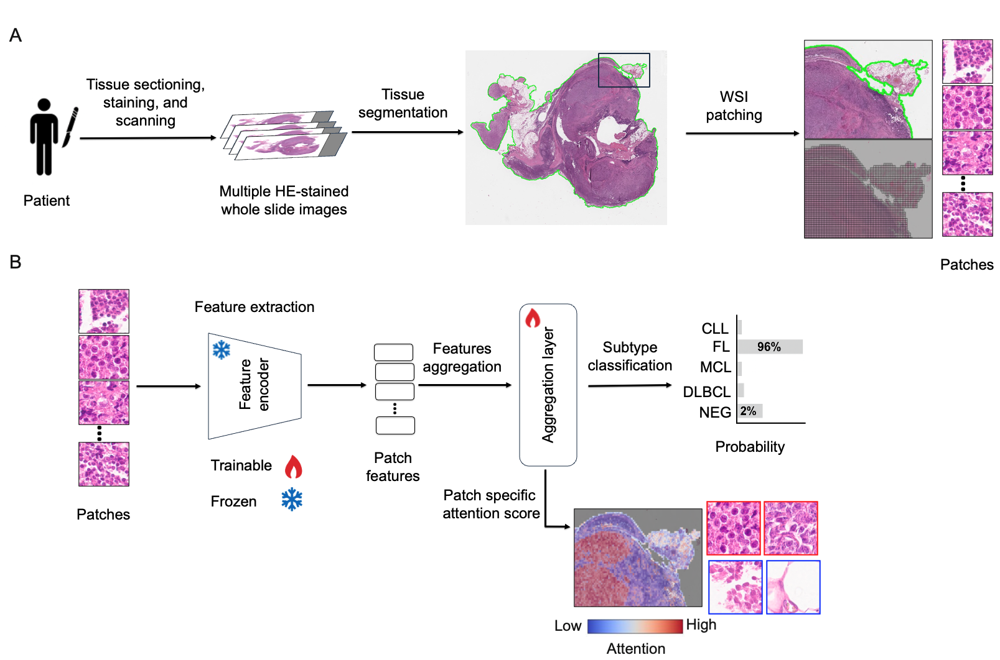

# A Multicenter Benchmark of Multiple Instance Learning Models for Lymphoma Subtyping from HE-stained Whole Slide Images
An official PyTorch implementation of the [LymphomaMIL](https://github.com/RaoUmer/LymphomaMIL) pipeline as described in the paper [A Multicenter Benchmark of Multiple Instance Learning Models for Lymphoma Subtyping from HE-stained Whole Slide Images](https://arxiv.org/pdf/2512.14640).

### Multicenter Lymphoma Benchmark
<p align="center">
  
</p>

### Pipeline Overview
<p align="center">
  
</p>

### 1. Tissue Segmentation and Patch Extraction
Our HE-stained whole slide images contain pen marks and artifacts, i.e., blurring, compression, water bubbles. In our pipeline, we use [Trident](https://github.com/mahmoodlab/TRIDENT) for both tissue segmentation and patch extraction; it employs a DeepLabV3-based segmentation model that provides more robust and stain-agnostic tissue detection and segmentation, and further extract non-overlapping patches from a whole slide image. 

*Code Usage*:

- Install Trident from the following [link](https://github.com/mahmoodlab/TRIDENT?tab=readme-ov-file#-1-installation).

```
cd path/to/trident/
python run_batch_of_slides.py \
       --task coords \
       --remove_artifacts \
       --wsi_dir /path/to/slides/ \
       --job_dir /path/to/save/trident_processed/ \
       --mag 40 \  # [10x, 20x, 40x]
       --patch_size 224 \
       --overlap 0
```


### 2. Feature Extraction
Features are extracted from the image patches by five publicly available pathology foundation models. 


Code to extract features from patches and save them to tensors. For each task and foundation model, it generates for each slide a 2D tensor of shape number of patches by number of features.

*Code Usage*:
```
python feat_extraction_patch_level.py \
       --data_path path/to/slide/data/files/tiles/ \
       --csv_path  path/to/slide/data/files/task.csv
       --out_path  path/to/save/slide/features/ \
       --encoder   patch_foundation_model \
       --tilesize  224
       --workers 10
```

```
python feat_extraction_patch_level_sqlite_format.py \
       --data_path path/to/slide/data/files/ \
       --out_path  path/to/save/slide/features/ \
       --encoder   patch_foundation_model \
       --tilesize  224
       --workers 10
```

```
python feat_extraction_slide_level.py \
       --data_path path/to/slide/data/features/ \
       --out_path  path/to/save/slide/features/ \
       --encoder   slide_foundation_model \
       --max_patches 4096 \
       --sample_strategy random \
       --tilesize  512 \
       --workers 10
```

Alternatively, for the standard slide format, e.g., .svs, we use trident to extract features.

```
cd path/to/trident/
python run_batch_of_slides.py \
       --task all \
       --remove_artifacts \
       --wsi_dir /path/to/slides/ \
       --job_dir /path/to/save/trident_processed/ \
       --patch_encoder patch_foundation_model \
       [or  --slide_encoder slide_foundation_model \]
       --mag 40 \ # [10x, 20x, 40x]
       --patch_size 224 \
       --overlap 0
```

### 3. K-Fold Cross-Validation (Patient-wise)
CSV files are generated to perform patient-level k-fold cross-validation data splitting that are used in the next step for feature aggregation and MIL models training.

*Code Usage*:

- Generates a CSV with slide ID, label, and slide features path. Extracts patient ID, label, and sample number from `.h5` files resulting from feature extraction step and stores the information in a CSV by using following script:
```
cd path/to/datasets/
python generate_csv_data.py
```

- Performs patient-wise stratified k-fold cross-validation and assigns `train`, `val`, and `test` splits by using the following script:
```
cd path/to/datasets/
python kfold_splits.py
```

### 4. Feature Aggregation and MIL Models Training
*Code Usage*:

- Multiple Instance Learning (MIL) models training are performed using following code scripts: 
```
cd path/to/feature_aggregation/
python train_kfold.py \
       --output /path/to/outputs/ \
       --data /path/to/datasets/5fold_splits.csv \
       --encoder [patch or slide foundation model] \
       --method [aggregators model] \
       --lr 0.0001 \
       --kfold 0 \ # [choices: 0 to 4]
       --num_classes 5
```

```
cd path/to/feature_aggregation/
python train_kfold_bel.py \
       --output /path/to/outputs/ \
       --data /path/to/datasets/5fold_splits.csv \
       --encoder [patch or slide foundation model] \
       --method transMILBEL \
       --lr 0.0001 \
       --kfold 0 \ # [choices: 0 to 4]
       --num_classes 5
```
- For model testing, use the following script:
```
cd path/to/feature_aggregation/
for kfold in {0..4}
do
     echo "=== Running fold $kfold ==="

     python test_kfold_augsburg.py \
         --output /path/to/outputs/ \
         --data /path/to/datasets/5fold_splits.csv \
         --checkpoint /path/to/saved/model/checkpoint_latest_kfold${kfold}.pth \
         --encoder [patch or slide foundation model] \
         --method [aggregators model] \
         --kfold $kfold \
         --num_classes 5

done
```
### 5. Attention Visualization
The attention scores can be visualized as heatmaps to highlight diagnostically informative
regions, areas assigned high attention, while de-emphasizing regions of low relevance, such
as normal tissue or background artifacts.

*Code Usage*:

```
cd path/to/attention_visualization/
python create_heatmaps.py
```
---

## Requirements
Please refer to the corresponding `environment.yml` for software dependencies and environment setup.
